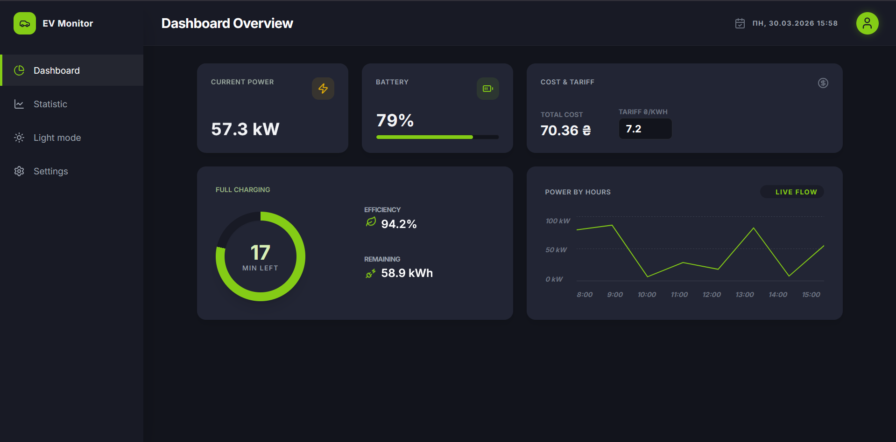
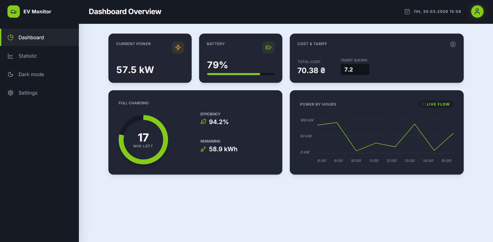
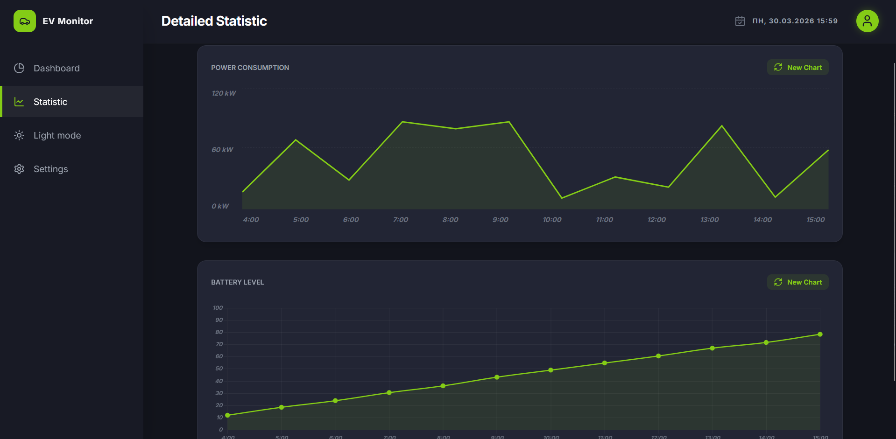
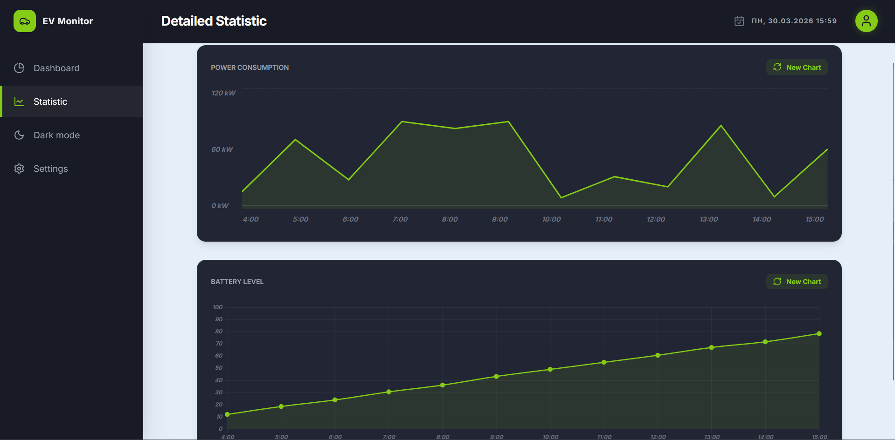
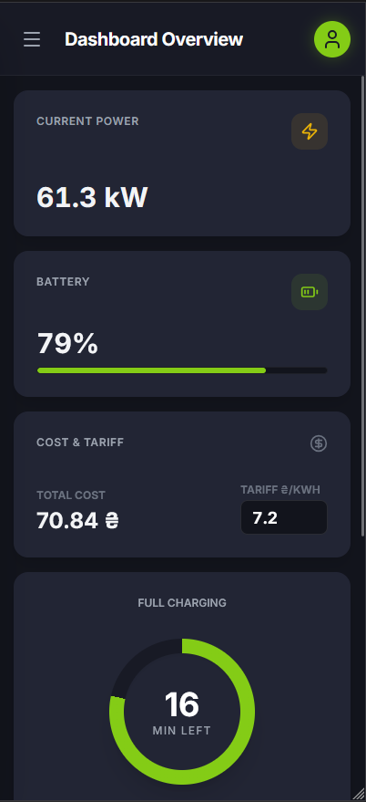
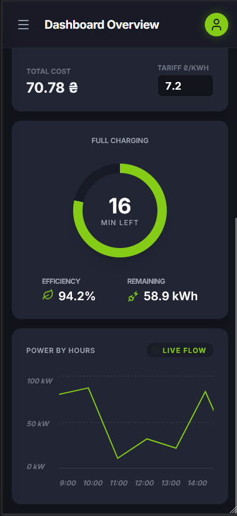
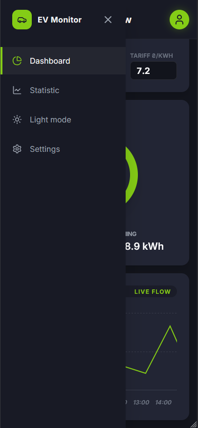
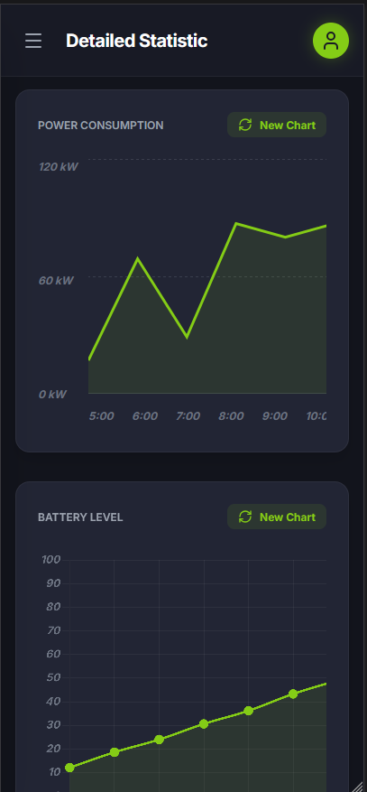

# EV Monitor React version

A dashboard for monitoring electric vehicle charging

Built with **React** **TypeScript** and **Tailwind CSS**. Supports dark and light themes.

## Launch
```bash
git clone https://github.com/LilRaime/ev-monitor-react.git
cd ev-monitor-react
```

```bash
npm install
npm install -D tailwindcss postcss autoprefixer
npx tailwindcss init -p
```

### Run
```bash
npm run dev   # for dev
npm run build # for prod
```

## Screenshots






### Mobile

<table>
  <tr>
    <td></td>
    <td></td>
  </tr>
</table>
<table>
  <tr>
    <td></td>
    <td></td>
  </tr>
</table>